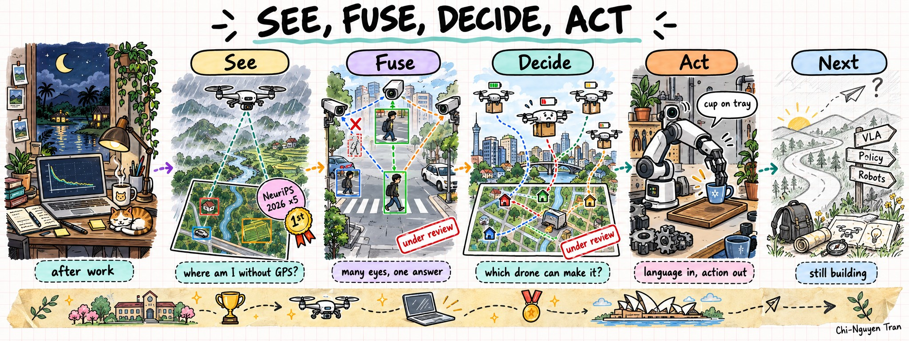
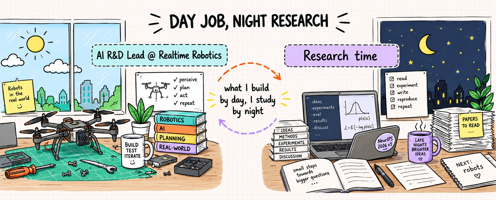

### Chi-Nguyen Tran

Ho Chi Minh City, Vietnam

I want machines that can see where they are, agree on what many sensors tell them, decide what to do as a team, and act on it.

<table>
<tr>
<td width="50%" valign="top">

#### Now
- AI R&D Lead @ Realtime Robotics
- Freelance web developer, clients in Canada
- Final-year AI student @ VNUHCM University of Science
- Reviewer, ACL and CVPR Workshops

</td>
<td width="50%" valign="top">

#### News
- **Sep 2026** · 5 papers accepted at NeurIPS 2026, 2 co-first
- **Aug 2026** · Vallet Scholarship 2026
- **Jul 2026** · Winner, FSE-AIWare 2026 tool competition
- **Dec 2025** · 1st Place, NeurIPS 2025 Mouse vs. AI

</td>
</tr>
</table>

#### Research direction
- **See:** drones that localize without GPS by matching their view to satellite maps, in fog, rain and at night
- **Fuse:** multi-camera perception that uses the geometry between views, so a new sensor helps instead of confusing the tracker
- **Decide:** multi-agent drone delivery where each drone's real battery capability is unknown and learned online
- **Act (next):** vision-language-action models, policy learning and robotics

#### Selected papers
| Venue | Paper |
|---|---|
| **NeurIPS 2026** | [Weather-Robust Cross-View Geo-Localization via Prototype-Based Semantic Part Discovery](https://arxiv.org/abs/2605.11654) · co-first |
| **NeurIPS 2026** | [MIST: Reliable Streaming Decision Trees for Online Class-Incremental Learning via McDiarmid Bound](https://arxiv.org/abs/2605.11617) · co-first |
| **NeurIPS 2026** | [Unlocking Compositional Generalization in Continual Few-Shot Learning](https://arxiv.org/abs/2605.11710) |
| **NeurIPS 2026** | [Training-Free Cultural Alignment of LLMs via Persona Disagreement](https://arxiv.org/abs/2605.10843) |
| **FSE 2026** | [MEMRES: Memory-Augmented Resolver for Agentic Python Dependency Resolution](https://doi.org/10.1145/3803437.3808242) · co-first, winner |

Two multi-agent papers (drone fleets, multi-camera tracking) under review at AAMAS 2027. Full list on the [website](https://chisngyen.github.io/publications/).

#### Stack
**Research** &nbsp; 

**Web** &nbsp; 

